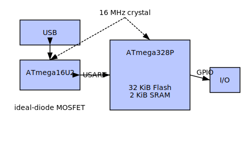

Hardware Overview
=================

This section provides a first-principles walkthrough of the Arduino Uno R3
architecture. It synthesizes physical limitations, digital logic and system
level behavior to highlight design trade-offs and missing parameters in the
official datasheets.

Semiconductor Foundations
-------------------------
The ATmega328P and ATmega16U2 microcontrollers are fabricated on a
180nm CMOS process. Gate capacitance of roughly 1--2 fF per square micron
limits switching speed and helps determine power consumption through the
CV^2f relationship. Silicon's 1.12 eV band gap sets a practical operating
voltage floor near 2.7\,V once threshold and noise margins are accounted for.

Execution Pipeline
------------------
AVR cores implement a two-stage pipeline. Most ALU instructions finish in a
single cycle, while branches and memory operations require two cycles. Skip
instructions (`SBIS`/`SBIC`) exploit this pipeline by invalidating the next
fetched instruction, providing conditional execution without a full branch.

Memory Architecture
-------------------
Flash, SRAM and EEPROM form three separate address spaces. Program flash
(32\,KB) is organized as 16-bit words with 128-byte pages for self-programming.
SRAM is true dual-port, enabling simultaneous instruction fetch and data
access with no wait states. EEPROM writes are slow—about 3.4\,ms per byte—but
can proceed in the background.

Clocking and Power
------------------
A 16\,MHz crystal drives a Pierce oscillator. The ATmega16U2 uses a
fractional-N PLL to generate a 48\,MHz clock for USB. Power distribution
includes an ideal-diode MOSFET for automatic supply selection and a suite of
bulk and ceramic capacitors for decoupling.

Communication Stack
-------------------
The 16U2 handles USB using NRZI encoding with bit stuffing. It provides up to
four 64-byte endpoints. The 328P communicates with the 16U2 via USART,
forming a virtual shared memory for buffering and protocol handling. The board
uses a two-chip arrangement as shown in :numref:`uno-arch`.

.. _uno-arch:

   System-level partitioning of compute, USB and shield I/O domains.

Integrated Architecture
-----------------------
The two-MCU arrangement allows the ATmega16U2 to focus solely on USB tasks
while the ATmega328P runs the nanokernel and application code. A 16\,MHz
crystal feeds both chips; the 16U2 multiplies it to 48\,MHz for full-speed
USB. Power from VIN or USB passes through an ideal-diode MOSFET before
fanning out to the regulators. The 328P exposes 32\,KiB of flash and 2\,KiB of
SRAM to the nanokernel. Locks and door-based RPC provide microsecond-scale
context switches. TinyLog-4 uses the on-chip EEPROM for wear-levelled
persistent storage.

Gaps in the Datasheets
----------------------
Several parameters are left unspecified in the official documentation:

* Junction-to-ambient thermal resistance
* Crystal ESR and oscillator startup calculations
* Brown-out detection thresholds and response time
* ADC integral and differential non-linearity figures
* USB suspend current characteristics

Optimization Notes
------------------
For maximum performance, align hot loops to flash page boundaries and keep
interrupt vectors in lower memory. For minimal power consumption, disable
unused peripherals via the PRR register and use power-down sleep with watchdog
wake-up.

Portability Note
----------------
``NK_LOCK_ADDR`` must be placed in the lower I/O range (``≤ 0x3F``) so
single-cycle ``IN``/``OUT`` instructions can access the lock byte.
On 32‑bit AVR devices the Beatty lattice step (`NK_LATTICE_STEP`) is
multiplied by ``1024`` via ``NK_LATTICE_SCALE`` to prevent ticket overflow.

Scheduler Time Slice
--------------------
``scheduler_init()`` programs Timer/Counter0 for a 1\,kHz tick in
Clear Timer on Compare mode. ``OCR0A`` is calculated as
``F_CPU / 64 / 1000 - 1`` and is compile-time checked to fit the
8‑bit timer. With prescaler ``64`` this yields an interrupt every
millisecond. The ``TIMER0_COMPA_vect`` handler invokes
``context_switch()`` so each task receives a 1\,ms quantum.
``scheduler_run()`` enables the timer and global interrupts before
handing control to the first task.
The scheduler combines round‑robin preemption with a
priority search and DAG dependency tracking reminiscent of the
``SMF‑Meets‑Minix‑Reserrection‑DAG‑meets‑Beaatty`` hybrid. Tasks may be
blocked on outstanding dependencies and are rescheduled automatically when
their dependency count reaches zero.
